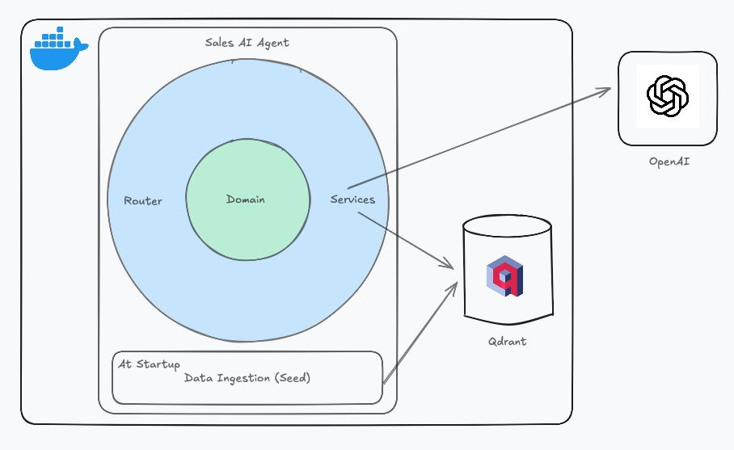

## Description

AI Sales Agent is an autonomous module designed to assist sales teams by intelligently handling prospect interactions. Upon receiving a new message from a prospect within an ongoing conversation, the agent analyzes the message in context, leverages external knowledge sources and internal tools, and determines the most effective response.

This project focuses on approaching different themes related to API Design, Code quality, LLM integration and RAG. It makes use of a vectorial database (qdrant), it uses the official OpenAI SDK for building agents and it is also dockerized for further deploy. The system is built to support modular evaluation and future scalability, enabling easy integration with real-world sales workflows.

### Built With

* [Python](https://www.python.org/)
* [FastAPI](https://fastapi.tiangolo.com/)
* [Uvicorn](https://www.uvicorn.org/)
* [OpenAI](https://platform.openai.com/docs/libraries)
* [OpenAI Agents SDK](https://openai.github.io/openai-agents-python/)
* [Qdrant](https://qdrant.tech/)
* [Docker](https://www.docker.com/)

### System Architecture



## Getting Started

The following instructions get you a local running copy of the application.

### Prerequisites

* Docker
* Python (if you want to run the agent in a different environment than qdrant)

### Installation

1. Clone the repo
   ```sh
   git clone https://github.com/viniciusromani/sales-ai-agent.git
   ```

2. Create a `.env` file on project's root folder with the following variables:
   ```sh
    OPENAI_API_KEY={{Your OpenAI Key}}
    QDRANT_HOST={{Qdrant Host}}
   ```
Obs. If you are using docker to run, `QDRANT_HOST` will be `qdrant` since it is the service name on `docker-compose.yml` file.

3. Run `docker-compose`
   ```sh
   docker-compose up
   ```

### Installation (without docker)

1. Clone the repo
   ```sh
   git clone https://github.com/viniciusromani/sales-ai-agent.git
   ```

2. Create a `.env` file on project's root folder with the following variables:
   ```sh
    OPENAI_API_KEY={{Your OpenAI Key}}
    QDRANT_HOST={{Qdrant Host}}
   ```
Obs. If you follow step #3 to get a local qdrant running. Your `QDRANT_HOST` will be `http://localhost:6333` unless you changed port value.

3. Follow [these instructions](https://qdrant.tech/documentation/quickstart/) to get you qdrant running
Obs. You might access `http://localhost:6333/dashboard` to check qdrant UI and your local collections.

4. (Recommended) Create a [virtual environment](https://docs.python.org/pt-br/dev/library/venv.html) and activate it.

5. Install dependencies
   ```sh
    pip install -r requirements.txt
   ```

### Tests

1. Run tests
   ```sh
   pytest
   ```
2. Get unit tests coverage
   ```sh
   pytest --cov-report html
   ```
Obs. It will generate a folder `htmlcov/` on project root. Inside this folder there is a `index.html` file that you can open in any browser to check coverage in a human readable way

<!-- ROADMAP -->
## Roadmap

- [ ] Create migrations to apply database changes (currently using `syncronize: true` which is not recommended for production environment)
- [ ] Fix query-param parse on get endpoint using `class-validator` and `class-transformer` library
- [ ] Allow database batch size to be defined on the fly
- [ ] Create unit tests for `currency-service`
- [ ] Create some integration tests (there is none now)

<!-- CONTRIBUTING -->
## Contributing

Contributions are what make the open source community such an incredible place to learn, inspire, and create. Any contributions you make are **greatly appreciated**.

If you have a suggestion that would make this better, please fork the repo and create a pull request. You can also simply open an issue with the tag "enhancement".
Don't forget to give the project a star! Thanks again!

1. Fork the Project
2. Create your Feature Branch (`git checkout -b feature/AmazingFeature`)
3. Commit your Changes (`git commit -m 'Add some AmazingFeature'`)
4. Push to the Branch (`git push origin feature/AmazingFeature`)
5. Open a Pull Request

<!-- CONTACT -->
## Contact

Vinicius Romani - vn.romani@gmail.com