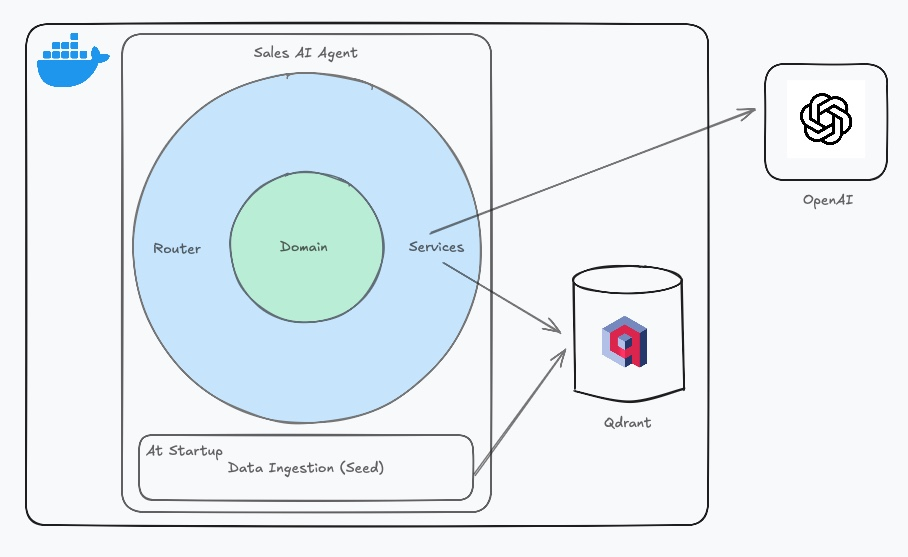

## Purpose

This document provides a brief overview of the system architecture, data flow, and key design decisions.

### Diagram

### API

The API exposes a single endpoint: `process_message`.
    * Routing is organized under the `routers` folder to keep `main.py` clean and scalable — making it easier to add middleware or new endpoints in the future.
    * Business logic is encapsulated in the `domain` folder to keep route handlers minimal and focused. Although exception handling currently occurs across different layers, all exceptions are raised directly. In a production environment, it would be better to handle errors closer to where they occur and re-raise them in a controlled way for the router to decide how to expose them to the user.
    * The `service` folder handles communication with external resources. Services are designed to be thin — they should only pass data to the domain layer for processing.
    * External resources are managed as singletons in the `external` folder to avoid recreating them for every request, improving performance.
    * `agents` and `tools` have their own folders but follow a similar pattern: a factory creates them on demand. Tools also use the Template Pattern due to their slightly more complex structure, combining both Template and Factory Patterns. They are stateless and instantiated on demand using a factory pattern. This ensures that each request receives an isolated instance, avoiding shared state issues and making the system safe for concurrent requests.

## Design

The application is containerized with Docker to simplify deployment and delivery.
    * Data flow overview: When a message is received by the `process_message` endpoint, it is routed to the domain layer where business logic is applied. If external context is required, the `agent` queries the vector store (Qdrant) or `MOCK_CRM` depending on the capability needed (extracted by LLM). Retrieved context and the original message are then treated by LLM which generates the response. The final response is returned to the client.
    * For logging, a custom formatter is used to output structured logs (JSON format can be easily plugged in) to stdout. This setup allows integration with observability tools like Grafana Loki or Datadog.
    * In a production setup, metrics (e.g., request duration, agent response time) could be exposed via a Prometheus-compatible endpoint. Distributed tracing (e.g., with OpenTelemetry) would also allow end-to-end tracking of each request through the system. These features are not yet implemented but are part of a production-ready environment.
    * A vector database instance (Qdrant) is used and defined as a dependency of the API container.
    * Before the API becomes available, seed data is ingested into the database. This seed reads a file from the data folder, splits the content into chunks, checks for duplicates, and inserts only new content.
    * This approach was chosen for simplicity, but it could increase API startup time with larger datasets. In a production setting, a separate data ingestion pipeline would be more appropriate.
    * A standard RAG (Retrieval-Augmented Generation) search is used for fetching data from the vector store. No similarity threshold is applied, though Qdrant supports it. Given that the data is controlled and chunked, this basic approach is sufficient for now. However, in a production environment, I would monitor Qdrant’s similarity scores and adjust accordingly.

## Prompting

According to the [OpenAI documentation](https://platform.openai.com/docs/guides/text?api-mode=responses#message-formatting-with-markdown-and-xml), formatting prompts using Markdown or XML improves performance. Based on this, all prompts were written using Markdown formatting.

An example in the docs shows how to build a prompt for an [eager agent](https://platform.openai.com/docs/guides/text?api-mode=responses#system-prompt-reminders) — this example served as the foundation for my implementation. I iterated on the prompts through testing during development. Prompt engineering is an ongoing process, and in a production environment, continuous evaluation and refinement would be essential.
